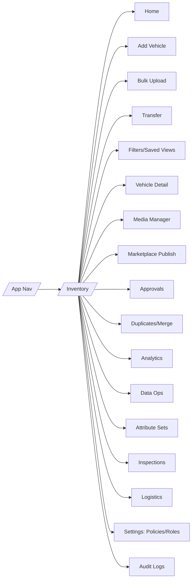

# Aura Inventory — Screen Catalog, Navigation, Access Levels & Issue Fixes (Reconciled)

This document consolidates your **latest requirements** with the earlier Inventory specs and highlights all **mismatches/issues** found. It then defines a full **screen catalog**: how to navigate, who can access, what each screen does, the dependencies/guards, and success/error states. It also includes mobile/touch acceptance criteria.

---
## 0) Delta Review — What changed vs the prior Inventory doc

| # | Topic | Earlier Spec | New Requirement | Decision (Reconciled) |
|---:|---|---|---|---|
| 1 | **Basic branch count** | Basic = 1 branch | Basic supports **≤2 branches** | Adopt ≤2; branch switcher visible in Basic |
| 2 | **Bulk Upload in Basic** | Not available | Available but **heavily capped** | Enable with **200 rows/job**, basic schema only |
| 3 | **Transfers in Basic** | Unclear/not explicit | **Allowed** between the two branches | Enable transfer w/ minimal logistics |
| 4 | **Logistics in Basic** | Minimal/unspecified | **Included** (limited presets) | Allow 1–2 carrier presets; basic tracking |
| 5 | **Per‑branch look & feel** | Not specified | Branches should **look/feel different** | Add branch theme (colors/logo) in Advanced; Lite tag in Basic |
| 6 | **Gating/redirects** | Partially covered | Needs strict **branch‑first** and **return‑to‑intent** | Implement route guards + modals (see Section 2) |
| 7 | **Marketplace policy** | Masked in Basic | Same | No change: default masked in Basic |
| 8 | **Attribute depth** | Advanced only | Same | No change |
| 9 | **Analytics** | Advanced BI | Same; Basic wants very lite | Keep Lite counters in Basic; full BI in Advanced |
|10 | **Two inventory types** | Basic vs Advanced | Same but Basic very capable (w/ caps) | Keep two tiers; ensure caps explicit |

---
## 1) Issues Found & Fix Plan

1) **Ambiguity on Basic capabilities**  
- *Issue*: Prior doc implied Basic = 1 branch and no bulk; requirement now = ≤2 branches + capped bulk + transfers/logistics.  
- *Fix*: Update caps, screens, and guards to reflect **≤2 branches**, **bulk(200)**, **transfer allowed**, **logistics presets**.

2) **No explicit branch‑first enforcement**  
- *Issue*: Add Vehicle could start without a valid branch.  
- *Fix*: **Blocking modal** for branch creation if `branch_count=0`; **branch picker** if no active branch; always return to intent.

3) **Navigation gaps**  
- *Issue*: Inconsistent paths and missing back paths (e.g., from Transfer to detail).  
- *Fix*: Standardize paths, breadcrumbs, and deep links (see Section 3 & 4).

4) **Role/Stage gates under‑specified**  
- *Issue*: Not all screens documented with min **verification stage** and **role**.  
- *Fix*: Provide per‑screen **Access Gate** table (Section 4).

5) **Mobile/touch acceptance missing**  
- *Issue*: No explicit criteria for touch devices.  
- *Fix*: Add **Touch & Mobile Acceptance** (Section 6).

6) **Error states & recovery**  
- *Issue*: Mixed handling of duplicates, policy violations, or cap exceedance.  
- *Fix*: Add per‑screen error/recovery patterns (Section 4) + global toasts.

---
## 2) Global Navigation & Guards

**Route Guards (simplified):**
- If `verification_level ∈ {unverified, provisional}` → redirect `/onboarding/basic?intent=inventory`.
- If `branch_count=0` → render `/inventory/branch-first` (blocking modal path) before any create/edit.
- If Basic and `branch_count>2` → block creation of 3rd branch (upsell to Advanced).
- If Basic and **Bulk Upload** > 200 rows → split job + show cap notice.

---
## 3) Screen Catalog — Overview Table

**Legend**: **Stage** = min verification; **Role** = min role. Modes: **B**asic/**A**dvanced.

| Screen | Path | Stage | Role | Mode | Key Features |
|---|---|---|---|:---:|---|
| Inventory Home | `/inventory` | Basic_Verified | Any member | B/A | Branch switcher, stats, filters, list/card, quick actions |
| Branch First (blocking) | `/inventory/branch-first` | Basic_Verified | Owner/Admin/BranchMgr | B/A | Create primary branch before any create |
| Create/Edit Branch | `/inventory/branches/new|:id` | Basic_Verified | Owner/Admin/BranchMgr | B/A | Name, address, brands; Advanced: theme, SLAs, manager |
| Add Vehicle | `/inventory/new` | Basic_Verified | InvOps/BranchMgr/Admin | B/A | Manual/VIN/Reg decode, QC lite, draft/publish |
| Vehicle Detail | `/inventory/:vehicleId` | Basic_Verified | Org members (scoped) | B/A | Tabs: Specs, Media, Docs, Pricing, History |
| Edit Vehicle | `/inventory/:vehicleId/edit` | Basic_Verified | InvOps/BranchMgr/Admin | B/A | Field edits (locked if policy), audit trail |
| Media Manager | `/inventory/:vehicleId/media` | Basic_Verified | InvOps/BranchMgr/Admin | B/A | Uploads, reorder, AI cleanup (A) |
| Bulk Upload | `/inventory/upload` | Basic_Verified | InvOps/BranchMgr/Admin | B/A | CSV/XLS import; cap 200 in Basic; 5k in Adv |
| Transfer | `/inventory/:vehicleId/transfer` | Basic_Verified | InvOps/BranchMgr/Admin | B/A | Move stock between branches, lock & track |
| Filters & Saved Views | `/inventory?view=...` | Basic_Verified | Any member | B/A | Multi‑filter chips, save/share views |
| Marketplace Publish | `/inventory/:vehicleId/publish` | Basic_Verified | BranchMgr/Admin/Owner | B/A | Policy preview; Basic=masked default |
| Approvals Queue | `/inventory/approvals` | Basic_Verified | BranchMgr/Admin/Owner | B/A | Price/edit approvals, comments, SLAs |
| Duplicates/Merge | `/inventory/duplicates` | Basic_Verified | InvOps/BranchMgr/Admin | B/A | VIN/Reg similarity, merge wizard |
| Analytics (Lite/Adv) | `/inventory/analytics` | Basic_Verified | Admin/Owner, BranchMgr (branch) | B/A | Lite counters in Basic; BI in Advanced |
| Data Ops (Adv) | `/inventory/data-ops` | Advanced_Verified | Admin/Owner | A | Import history, error queue, schedules |
| Attribute Sets (Adv) | `/inventory/attributes` | Advanced_Verified | Admin/Owner | A | Category sets, dependencies, VIN map |
| Inspections (Adv) | `/inventory/inspections` | Advanced_Verified | InvOps/BranchMgr/Admin | A | Jobs, checklists, vendor reports |
| Logistics (Adv) | `/inventory/logistics` | Advanced_Verified | InvOps/BranchMgr/Admin | A | Carriers, dispatch, tracking, POD |
| Settings: Policies/Roles | `/inventory/settings` | Basic_Verified | Admin/Owner | B/A | Exposure, approvals, caps, role policies |
| Audit Logs | `/inventory/audit` | Basic_Verified | Admin/Owner/Compliance | B/A | Diff view, filters, export |

---
## 4) Screen Details — Navigation, Access, Features, Guards

> **Format:** *How to reach* · *Access Gate* · *Features* · *Empty/Success/Error* · *Dependencies/Guards*.

### 4.1 Inventory Home
- **How to reach:** App nav → Inventory; deep link `/inventory`.
- **Access Gate:** Stage ≥ Basic_Verified; any member; RLS scoping applied.
- **Features:** Branch switcher (B: ≤2), quick stats (stock, new, aging), list/card view, filters, bulk actions (publish/unpublish/export), CTAs (Add Vehicle, Bulk Upload, Transfer, Customize to Advanced).
- **Empty/Success/Error:** Empty → guided CTA; Success → updated counts; Error → RLS denial toast.
- **Dependencies/Guards:** If branch_count=0 → redirect to Branch First.

### 4.2 Branch First (Blocking)
- **How to reach:** Auto‑render when `branch_count=0`.
- **Access Gate:** Stage ≥ Basic_Verified; Owner/Admin/BranchMgr.
- **Features:** Create Branch modal (name, city, address, contact), set as default.
- **Empty/Success/Error:** Success → return to previous intent; Error → inline validation.
- **Dependencies/Guards:** Required before Add/Edit/Upload/Transfer.

### 4.3 Create/Edit Branch
- **How to reach:** Home → "Create Branch" or Branch menu; edit from branch chip.
- **Access Gate:** Owner/Admin/BranchMgr; Stage ≥ Basic_Verified.
- **Features:** Basic fields; Advanced adds theme (colors/logo), SLAs, manager, brand matrix.
- **Guards:** In Basic, **max 2 branches**; creating 3rd triggers upgrade modal.

### 4.4 Add Vehicle
- **How to reach:** Home → Add Vehicle; deep link with active branch.
- **Access Gate:** InvOps/BranchMgr/Admin; Stage ≥ Basic_Verified.
- **Features:** Source select (Manual/VIN/Reg); Core fields; QC lite; Save Draft; Publish to branch/org; Marketplace preview (policy).
- **Error:** Duplicate VIN/Reg → merge dialog; Policy violation (price band) → Approval required; Missing branch → branch picker.
- **Dependencies:** Active branch required; in Basic, media cap (10 photos) and field set limited.

### 4.5 Vehicle Detail
- **How to reach:** Click from list/card.
- **Access Gate:** Any org member (scoped by branch/org); Stage ≥ Basic_Verified.
- **Features:** Tabs (Specs, Media, Docs, Pricing, History, Activity); quick actions (Edit, Transfer, Publish, Reserve).
- **Dependencies:** Policy may lock Pricing until approval.

### 4.6 Media Manager
- **How to reach:** Vehicle Detail → Media.
- **Access Gate:** InvOps/BranchMgr/Admin.
- **Features:** Upload, reorder, label; AI cleanup (Advanced); caps per tier.

### 4.7 Bulk Upload
- **How to reach:** Home → Bulk Upload; Settings → Data Ops (Adv).
- **Access Gate:** InvOps/BranchMgr/Admin; Stage ≥ Basic_Verified.
- **Features:** Template download, preview, validate, import; job status.
- **Guards:** Basic cap = 200 rows/job; Advanced = 5k; schema differs (basic vs attribute sets).

### 4.8 Transfer Vehicle
- **How to reach:** Vehicle Detail → Transfer; list bulk action.
- **Access Gate:** InvOps/BranchMgr/Admin.
- **Features:** Select destination branch; optional logistics ticket; stock lock until complete.
- **Guards:** Basic requires destination within the **two branches**.

### 4.9 Filters & Saved Views
- **How to reach:** Home toolbar.
- **Access Gate:** Any member.
- **Features:** Multi‑chips, save/share view; branch and status filters.

### 4.10 Marketplace Publish
- **How to reach:** Vehicle detail → Publish.
- **Access Gate:** BranchMgr/Admin/Owner.
- **Features:** Policy summary; Basic = masked default; Advanced = choose Public/B2B/Masked.

### 4.11 Approvals Queue
- **How to reach:** Home → Approvals.
- **Access Gate:** BranchMgr/Admin/Owner; Finance for price locks.
- **Features:** Price band approvals, edit locks, SLA timers, comments.

### 4.12 Duplicates/Merge
- **How to reach:** Home → Duplicates; Add Vehicle duplicate flow.
- **Access Gate:** InvOps/BranchMgr/Admin.
- **Features:** VIN/Reg similarity, side‑by‑side merge, audit.

### 4.13 Analytics (Lite/Adv)
- **How to reach:** Home → Analytics.
- **Access Gate:** Owner/Admin; BranchMgr sees branch scope.
- **Features:** Basic = stock counts, age buckets, sell‑through; Advanced = cohort, source ROI, branch dashboards, exports.

### 4.14 Data Ops (Advanced)
- **How to reach:** Home → Data Ops or Settings.
- **Access Gate:** Admin/Owner; Stage = Advanced_Verified.
- **Features:** Import history, error queue, schedules, connectors.

### 4.15 Attribute Sets (Advanced)
- **How to reach:** Settings → Attributes.
- **Access Gate:** Admin/Owner; Stage = Advanced_Verified.
- **Features:** Category schemas, dependencies, VIN/Reg mapping.

### 4.16 Inspections (Advanced)
- **How to reach:** Home → Inspections.
- **Access Gate:** InvOps/BranchMgr/Admin; Stage = Advanced_Verified.
- **Features:** Job board, checklists, media QC, vendor handoff.

### 4.17 Logistics (Advanced)
- **How to reach:** Home → Logistics.
- **Access Gate:** InvOps/BranchMgr/Admin; Stage = Advanced_Verified.
- **Features:** Carrier book, dispatch, tracking, POD.

### 4.18 Settings: Policies & Roles
- **How to reach:** Home → Settings.
- **Access Gate:** Admin/Owner.
- **Features:** Exposure policies, approval bands, caps, role templates, branch themes (Adv).

### 4.19 Audit Logs
- **How to reach:** Home → Audit.
- **Access Gate:** Admin/Owner/Compliance.
- **Features:** Diff view, filters, export CSV.

---
## 5) Permissions Quick Matrix (by screen)

| Screen | Owner | Admin | BranchMgr | InvOps | Sales |
|---|---:|---:|---:|---:|---:|
| Home | ✓ | ✓ | ✓ | ✓ | ✓ |
| Branch First | ✓ | ✓ | ✓ | ✕ | ✕ |
| Create/Edit Branch | ✓ | ✓ | ✓ | ✕ | ✕ |
| Add/Edit Vehicle | ✓ | ✓ | ✓ | ✓ | ✕ |
| Vehicle Detail | ✓ | ✓ | ✓ | ✓ | ✓ (read) |
| Media Manager | ✓ | ✓ | ✓ | ✓ | ✕ |
| Bulk Upload | ✓ | ✓ | ✓ | ✓ | ✕ |
| Transfer | ✓ | ✓ | ✓ | ✓ | ✕ |
| Marketplace Publish | ✓ | ✓ | ✓ | ✕ | ✕ |
| Approvals Queue | ✓ | ✓ | ✓ | ✕ | ✕ |
| Duplicates/Merge | ✓ | ✓ | ✓ | ✓ | ✕ |
| Analytics | ✓ | ✓ | ✓ (branch) | ✕ | ✕ |
| Data Ops | ✓ | ✓ | ✕ | ✕ | ✕ |
| Attribute Sets | ✓ | ✓ | ✕ | ✕ | ✕ |
| Inspections | ✓ | ✓ | ✓ | ✓ | ✕ |
| Logistics | ✓ | ✓ | ✓ | ✓ | ✕ |
| Settings | ✓ | ✓ | ✕ | ✕ | ✕ |
| Audit Logs | ✓ | ✓ | ✓ (branch) | ✕ | ✕ |

*All require Stage ≥ **Basic_Verified**; Advanced‑only screens require **Advanced_Verified**.*

---
## 6) Touch & Mobile Acceptance (Tablets/Phones)

- **Touch targets**: min 44×44 px; primary CTAs ≥ 48×48 px.
- **List cards**: whole row tappable; swipe for quick actions (Publish/Unpublish, Transfer).
- **Branch switcher**: bottom sheet on mobile; searchable; shows current branch chips.
- **Modals**: become full‑screen sheets on ≤768px.
- **Drag & drop (media)**: fallback buttons for upload/reorder on mobile.
- **Tables**: switch to stacked cards; sticky action bar.
- **Performance**: first contentful interaction < 2s on mid‑range Android; lazy‑load media; virtualize lists.
- **Keyboard**: numeric pads for price/odometer; VIN uses uppercase mask.

---
## 7) Empty/Success/Error Patterns (Global)

- **Empty**: descriptive illustration + one primary CTA relevant to the tier (e.g., "Create Branch" when none exist).
- **Success**: toast + optimistic UI (list updates instantly) + undo when safe.
- **Error**: toast + inline helper text; preserve user input; offer export of failed rows (bulk) or open merge dialog (duplicate).

---
## 8) Events & Auditing (Inventory)

- `branch.created|updated`, `vehicle.draft|approved|published|unpublished|transferred|sold`, `bulk.started|failed|completed`, `approval.requested|granted|denied`.
- All events carry `org_id`, `branch_id`, `actor_id`, and diff for audit.

---
## 9) QA Checklist (per feature)

- Guards redirect correctly (KYB, branch‑first, caps).  
- RLS hides cross‑branch data in Basic.  
- Add Vehicle cannot save without active branch.  
- Bulk Upload respects row caps and schema.  
- Transfer disallows destinations beyond 2 branches in Basic.  
- Marketplace publish masks price for Basic tenants by default.  
- Mobile gestures present; targets meet 44px rule.  
- Audit events emitted for all mutations.

---
**End of document.**

